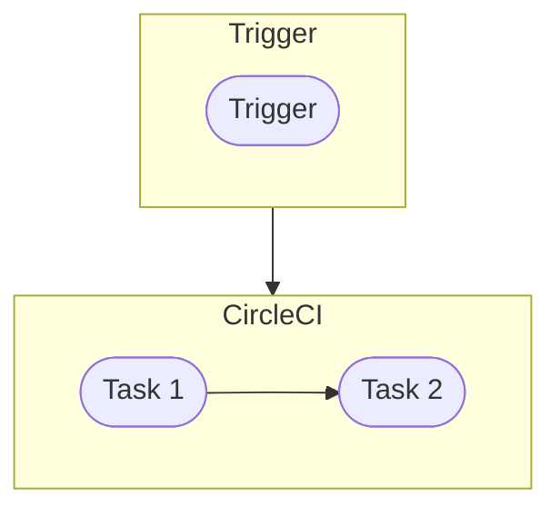

# Using UV in vscode
if running in a fresh dev container:
`pip3 install uv`

Make sure `UV_EXTRA_INDEX_URL` and `UV_INDEX_URL` are set in your .env:
```
UV_EXTRA_INDEX_URL=https://pypi.org/simple
UV_INDEX_URL=*******************
```

Load a terminal with the env vars and run:
`uv sync`

Once the .venv is created, run `CMD + SHFT + P > Select Interpreter` -> Choose the .venv

Reload the vscode window
`CMD + SHFT + P > Reload Window`

Add packages
`uv add package-name`

Remove packages
`uv remove package-name`

Run code inside the uv venv
`uv run ruff check`

# Ease-of-use-scripts

Run code-quality-check
`cqc`

Run pytest
`run_tests`


# Task Name
--------------------
Write a text description of what the task does here...



## Files Used:

| Filename | Location | Description |
|:----------:|:----------:|:-------------:|
| NAME_OF_FILE.filetype | Source | What we do with the file... |

## Environment Variables:
1. 
2. 
3. 

## Other yml commands that might be needed:
<ul>
<li><p>This block of code will run the command up to 3 times, and it will either exit after the first passing attempt or after all attempts have failed:</p>
<pre><code>command: for i in $(seq 1 3); do uv run python src main.py && s=0 && break || s=$? && sleep 5; done; (exit $s)</code></pre>
</li>
</ul>

# Code quality check
```
isort . --line-length 255
black . --line-length 255
ruff . --line-length 255 --ignore=E402
```